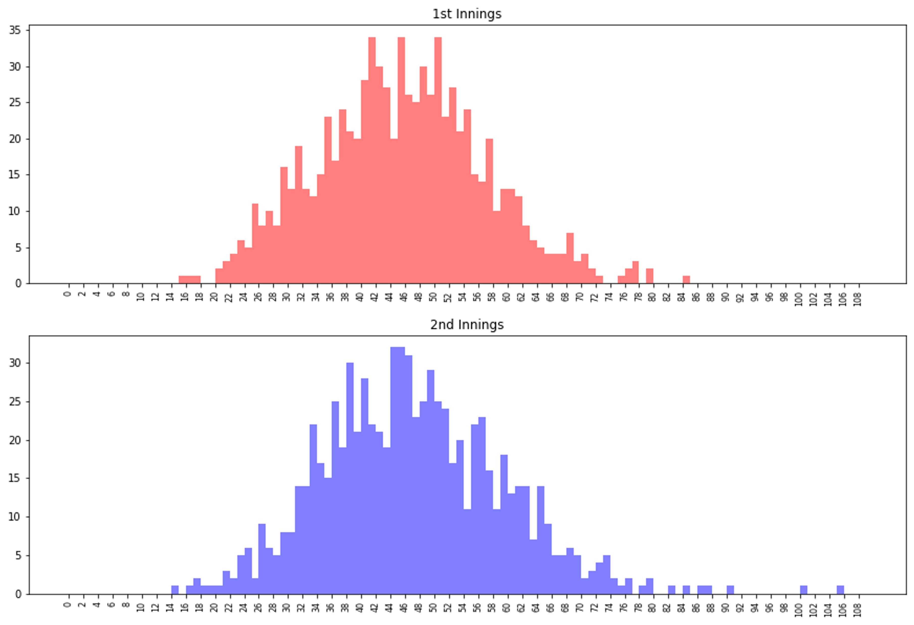
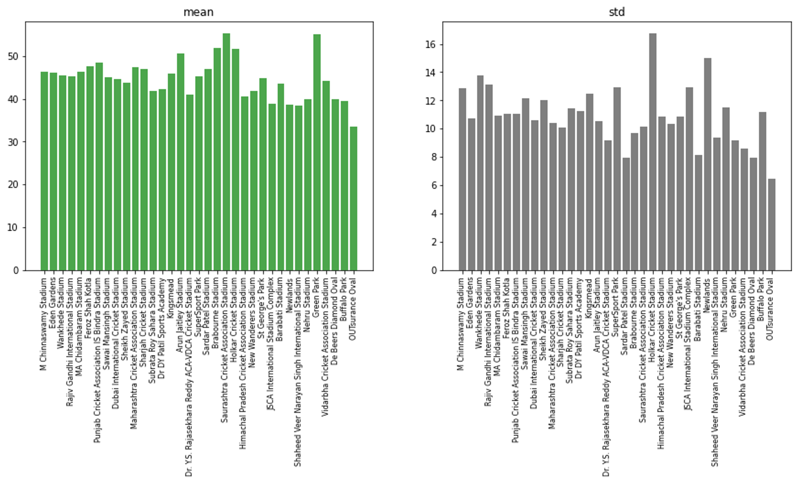
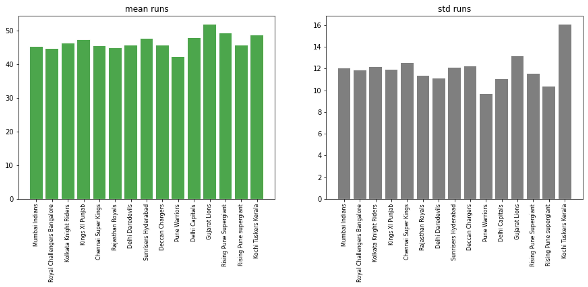
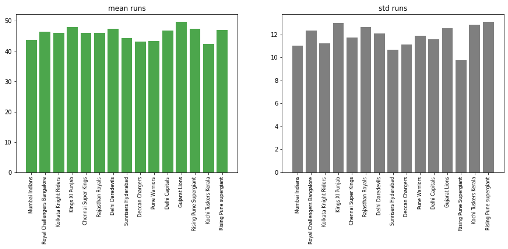

<p align="center">
  
</p>
<p align="center">
    <h1 align="center">Prediction of IPL Runs</h1>
</p>
<p align="center">
    <em>"Never make predictions, especially about the future" -Stengel</em>
</p>
<p align="center">
	
	
	
<p>
<p align="center">
		<em>Developed with the software and tools below.</em>
</p>
<p align="center">
	
	
    
    
    
    
    
</p>
<hr>

##  Quick Links

> - [ Overview](#overview)
> - [ Features](#features)
> - [ Repository Structure](#repository-structure)
> - [ Modules](#modules)
> - [ Visualisations](#visualisations)
> - [ Getting Started](#getting-started)
>   - [ Installation](#installation)
>   - [ Running ipl_score_predictor](#running-ipl_score_predictor)
> - [ Project Roadmap](#project-roadmap)
> - [ Acknowledgments](#acknowledgments)

---

##  Overview

This project has been developed for the `Cricket and Coding Challenge 2021` organised by IIT Madras.

Past 20 years of T20 Data has been used for developing the runs prediction model provided by [`Cricbuzz`](https://www.cricbuzz.com/cricket-scorecard-archives).

Various parameters regarding venue, wickets, runs, mistakes have been used to create player profile which are then numerically represented as `mean score per ball` for the neural network input parameter.

Following parameters are used as inputs for the developed model to predict the scores as specified in the contest specifications:
`venue`, `innings`, `ball`, `batting_team`, `bowling_team`, `batsmen`, `bowlers`.

A `Keras` model was trained and then the weights and biases of the resulting model were imported into a `PyTroch Sequential Model` as the contest website couldn't run the `Keras` model which was a later realization.


---

##  Features
Following parameters are used for the NeuralNetwork model in `Keras`.

The `mean score per ball` represents a bowler/batsman.

The `mean score of venue` represents the venue.

The Keras Sequential Regressor Model  has been trained with the following attributes:
- Activation Function : `ReLU`
- Optimizer : `Adam`
- Learning Rate for Optimizer : `0.002`
- Training Epochs : `40 Epochs`

---

##  Repository Structure

```sh
└── ipl_score_predictor/
    ├── Algorithm.txt
    ├── Model_keras.ipynb
    ├── Model_pytorch.ipynb
    ├── README.md
    ├── Untitled.ipynb
    ├── all_matches_numeric.csv
    ├── batsmen.csv
    ├── bowlers.csv
    ├── dnn_model
    │   ├── saved_model.pb
    │   └── variables
    │       ├── variables.data-00000-of-00001
    │       └── variables.index
    ├── files
    │   ├── input_test_data.csv
    │   ├── ipl_csv2
    │   │   ├── 981019.csv
    │   │   │
    .   .   . 
    .   .   .
    .   .   .   
    │   │   ├── README.txt
    │   │   └── all_matches.csv
    │   └── ipl_csv2.zip
    ├── files_relevant
    │   ├── README.md
    │   ├── all_matches.tsv
    │   ├── input_test_data.tsv
    │   └── three_matches.tsv
    ├── keras_model.h5
    ├── libraryVersions.txt
    ├── parse_data.py
    ├── parse_player_runs.py
    ├── parse_to_numeric.py
    ├── parse_venue_runs.py
    ├── pytorch_model.pt
    ├── submissionFormat
    │   ├── __pycache__
    │   │   └── predictor.cpython-38.pyc
    │   ├── submission
    │   │   ├── IITMBSC02810.zip
    │   │   ├── batsmen.csv
    │   │   ├── bowlers.csv
    │   │   ├── dnn_model
    │   │   │   ├── saved_model.pb
    │   │   │   └── variables
    │   │   │       ├── variables.data-00000-of-00001
    │   │   │       └── variables.index
    │   │   ├── main.py
    │   │   ├── predictor.py
    │   │   └── venue.csv
    │   └── submission_torch
    │       ├── IITMBSC02810.zip
    │       ├── __pycache__
    │       │   └── predictor.cpython-38.pyc
    │       ├── batsmen.csv
    │       ├── bowlers.csv
    │       ├── main.py
    │       ├── predictor.py
    │       ├── pytorch_model.pt
    │       └── venue.csv
    └── venue.csv
```

---

##  Modules

<!-- <details open><summary>main directory</summary> -->
Here the summarised descriptions of each of the `.py` files and `.ipynb` notbooks.
| File                                                                                                         | Summary                                          |
| ---                                                                                                          | ---                                              |
| [`parse_venue_runs.py`](https://github.com/rohan-deswal/ipl_score_predictor/blob/master/parse_venue_runs.py)   |This code reads a TSV file containing cricket match data, calculates the average runs scored in each venue, and saves the venue names along with their corresponding average runs to a CSV file named `venue.csv`|
| [`Model_pytorch.ipynb`](https://github.com/rohan-deswal/ipl_score_predictor/blob/master/Model_pytorch.ipynb)   | This notebook defines and initializes a neural network model using PyTorch, transfers weights from a pre-trained TensorFlow model, and uses the model to predict cricket match outcomes based on input data. It also includes saving and loading the PyTorch model for reuse  |
| [`parse_player_runs.py`](https://github.com/rohan-deswal/ipl_score_predictor/blob/master/parse_player_runs.py) | The code snippet reads a CSV file containing cricket match data, calculates average runs scored by batsmen and conceded by bowlers using weighted means, and saves the results to separate CSV files for batsmen and bowlers.|
| [`parse_data.py`](https://github.com/rohan-deswal/ipl_score_predictor/blob/master/parse_data.py)               | The provided code snippet reads cricket match data from a CSV file, calculates the total runs scored in the first six overs of each innings in the matches, and creates a new DataFrame with relevant match details such as venue, innings, ball, batting team, bowling team, batsmen, bowlers, and total runs. The summarized data is then saved to a new CSV file named `all_matches_relevant.csv` using tab as the separator.        |
| [`Model_keras.ipynb`](https://github.com/rohan-deswal/ipl_score_predictor/blob/master/Model_keras.ipynb)       | The Python notebook utilizes TensorFlow/Keras to train a neural network model for predicting cricket match runs based on various features such as venue, batsmen, and bowlers' performance averages. The model is trained and evaluated using a dataset, and then used to predict runs for a given test input CSV file, incorporating feature normalization and model building techniques.     |
| [`Untitled.ipynb`](https://github.com/rohan-deswal/ipl_score_predictor/blob/master/Untitled.ipynb)             | The Python notebook analyzes cricket match data, visualizing innings-wise runs distribution, match counts per venue, mean and standard deviation of runs scored per venue, and team-wise batting and bowling statistics including innings counts and runs metrics. |
| [`parse_to_numeric.py`](https://github.com/rohan-deswal/ipl_score_predictor/blob/master/parse_to_numeric.py)   | The code processes cricket match data by adding mean statistics for venues, batsmen, and bowlers, and then saves the modified dataset to a new CSV file for further analysis.|

Here are the submitted files with PyTorch model
[`submissionFormat/submission_torch/main.py`](https://github.com/rohan-deswal/ipl_score_predictor/blob/master/submissionFormat/submission_torch/main.py)
[`submissionFormat/submission_torch/predictor.py`](https://github.com/rohan-deswal/ipl_score_predictor/blob/master/submissionFormat/submission_torch/predictor.py)

Here are the submitted files with Keras model
[`submissionFormat/submission/main.py`](https://github.com/rohan-deswal/ipl_score_predictor/blob/master/submissionFormat/submission/main.py)
[`submissionFormat/submission/predictor.py`](https://github.com/rohan-deswal/ipl_score_predictor/blob/master/submissionFormat/submission/predictor.py)

---
## Visualisations
Here are the relevant visualisations present in `Untitled.ipynb`:


Histograms depicting player runs in 1st and 2nd innings.


Plot of number of matches per venue.


Plot of mean runs and standard deviation of runs per venue.


Plot of number of batting and bowling innings per team.


Plots of mean runs and standard deviation of runs by batting teams.


Plots of mean runs and standard deviation of runs by bowling teams.


---

##  Getting Started

***Requirements***

Ensure you have the following dependencies installed on your system:

* **Python**: `3.9+`

###  Installation

1. Clone the ipl_score_predictor repository:

```sh
git clone https://github.com/rohan-deswal/ipl_score_predictor
```

2. Change to the project directory:

```sh
cd ipl_score_predictor
```

3. Install the dependencies:

```sh
pip install -r libraryVersions.txt
```

###  Running ipl_score_predictor

Use the following command to run ipl_score_predictor:

```sh
python main.py
```

---

##  Project Roadmap

- [X] `Calculate runs after each ball`
- [X] `Create CSV database for all relevant data`
- [X] `Filter data for first 6 overs. (i.e. just before 6.1)`
- [X] `Visualise relationships between relevant data and runs`

---


##  Acknowledgments

Following resources were referred to while development of this project.

[`Getting started with Keras`](https://keras.io/getting_started/) Delve into the fundamentals of deep learning with Keras: An introductory guide tailored to help you grasp essential concepts and initiate your journey into practical neural network implementations.

[`Welcome to PyTorch Tutorials`](https://pytorch.org/tutorials/) Familiarize yourself with PyTorch concepts and modules. Learn how to load data, build deep neural networks, train and save your models in this quickstart guide.

---
